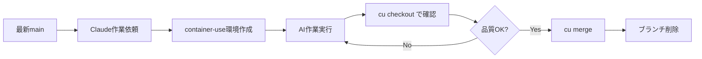

# Container-Use 実践ガイド

AIエージェント（Claude Code）と安全に作業するためのコンテナ環境ツール [container-use](https://github.com/dagger/container-use) の実践レポートです。

## Container-Use とは

Container-useは、AIエージェントが**独立したコンテナ内で安全に作業**できる環境を提供するツールです。

### 核心的な価値
- **🔒 安全性**: ホストシステムを保護しながらAIに自由な作業環境を提供
- **👀 可視性**: AIの全作業履歴をリアルタイムで追跡可能
- **🌿 Git統合**: 標準的なGitワークフローで作業を管理

### 基本的な仕組み
```
AIエージェント → Container-Use → 独立コンテナ → Git Worktree → マージ
```

## 実際に使ってわかった課題

### 1. ブランチ管理の重要性
**❌ 問題**: 古いブランチから環境を作成 → 大量のマージコンフリクト
```bash
# 危険な例
git checkout old-feature-branch
claude  # ここで環境作成すると古い状態ベース
```

**✅ 解決策**: 必ず最新のmainブランチから作業開始
```bash
git checkout main
git pull origin main
claude  # 最新状態から環境作成
```

### 2. 作業確認の難しさ
**❌ 問題**: `cu diff`の出力が大きすぎて確認困難

**✅ 解決策**: 段階的な確認フロー
```bash
# 1. 概要確認
cu list

# 2. 詳細確認（実際にチェックアウト）
cu checkout <env-id>

# 3. 通常のGitコマンドで詳細確認
git status
git diff
git log --oneline
```

### 3. 環境の使い分け
**学習**: 一つの大きなタスクより、小さなタスクごとに環境を分ける方が管理しやすい

## Difit との連携

### 現在の状況
- Container-useは**MCP (Model Context Protocol)** 経由でClaude Codeと連携
- DifitもMCP対応を検討中だが、まだ直接的な統合はなし

### 期待される連携効果
1. **安全なコード生成**: Difitが生成したコードをcontainer-use環境で安全にテスト
2. **継続的検証**: Difitの提案 → container-use環境でテスト → フィードバックループ
3. **学習データ**: Container-use環境での実行結果をDifitの学習に活用

### 現在可能な連携方法
```bash
# 1. Difitでコード案を生成
# 2. Container-use環境でClaude Codeがそのコードを実装・テスト
claude
> "Difitが提案したXXXの機能を実装してテストしてください"
```

## クイックスタート

### 1. インストール
```bash
# macOS
brew install dagger/tap/container-use

# Linux/その他
curl -fsSL https://raw.githubusercontent.com/dagger/container-use/main/install.sh | bash
```

### 2. Claude Codeとの連携
```bash
# MCPサーバー追加
claude mcp add container-use -- container-use stdio

# プロジェクトルール追加（推奨）
curl https://raw.githubusercontent.com/dagger/container-use/main/rules/agent.md >> CLAUDE.md
```

### 3. 基本的な使い方
```bash
# 最新ブランチに移動
git checkout main && git pull

# Claude Codeセッション開始
claude
> "新しい機能を実装してください"

# 作業確認
cu list                    # 環境一覧
cu log <env-id>           # 作業ログ確認
cu checkout <env-id>      # 実際の結果を確認

# 作業統合
cu merge <env-id>         # mainにマージ
git branch -d cu-<env-id> # ブランチクリーンアップ
```

## 推奨ワークフロー



## 重要な学び

1. **必ず最新ブランチから開始**: 古いブランチからの作業は避ける
2. **小さな単位で作業**: 大きなタスクは分割して管理
3. **段階的確認**: `cu diff`だけでなく`cu checkout`で実際に確認
4. **適切なクリーンアップ**: マージ後は必ずブランチを削除

## 参考リンク

- [Container-Use GitHub](https://github.com/dagger/container-use)
- [公式ドキュメント](https://container-use.com/quickstart)
- [Dagger Discord](https://discord.gg/dagger-io) (#container-useチャンネル)
- [Model Context Protocol](https://modelcontextprotocol.io/)

---

> **注意**: Container-useは現在実験的段階にあります。プロダクション使用前に十分なテストを行ってください。