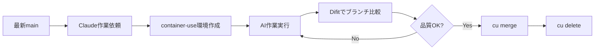

# Container-Use 実践ガイド

AIエージェント（Claude Code）と安全に作業するためのコンテナ環境ツール [container-use](https://github.com/dagger/container-use) の実践レポートです。

## Container-Use とは

Container-useは、AIエージェントが**独立したコンテナ内で安全に作業**できる環境を提供するツールです。

### 核心的な価値
- **🔒 安全性**: ホストシステムを保護しながらAIに自由な作業環境を提供
- **👀 可視性**: AIの全作業履歴をリアルタイムで追跡可能
- **🌿 Git統合**: 標準的なGitワークフローで作業を管理

### 基本的な仕組み
```
AIエージェント → Container-Use → 独立コンテナ → Git Worktree → マージ
```

## 実際に使ってわかった課題と解決策

### 1. ブランチ管理の重要性
**❌ 問題**: 古いブランチから環境を作成 → 大量のマージコンフリクト

**✅ 解決策**: 必ず最新の作業ブランチから作業開始
```bash
git checkout main && git pull origin main
claude  # 最新状態から環境作成
```

### 2. 作業確認の難しさ
**❌ 問題**: `cu diff`の出力が大きすぎて確認困難

**✅ 解決策**: Difitによる視覚的な確認
```bash
npx difit container-use/<env-id> main
```

### 3. 環境の使い分け
**学習**: 一つの大きなタスクより、小さなタスクごとに環境を分ける方が管理しやすい

## Difit との連携

### Difitとは
[Difit](https://github.com/yoshiko-pg/difit) は、Git diffをGitHub風のインターフェースで表示する軽量なコマンドラインツールです。

### 連携のメリット
- **視覚的な確認**: `cu diff`より読みやすいGitHub風インターフェース
- **AIレビュー**: diffの各行にコメント追加、AIプロンプトとして活用
- **効率的な確認**: ブラウザでの直感的な操作

### 推奨確認方法
```bash
# Container-useブランチを直接比較
npx difit container-use/<env-id> main
# 例: npx difit container-use/deciding-crayfish main
```

## クイックスタート

### 1. インストール
```bash
# macOS
brew install dagger/tap/container-use

# Linux/その他
curl -fsSL https://raw.githubusercontent.com/dagger/container-use/main/install.sh | bash
```

### 2. Claude Codeとの連携
```bash
# MCPサーバー追加
claude mcp add container-use -- container-use stdio

# プロジェクトルール追加（推奨）
curl https://raw.githubusercontent.com/dagger/container-use/main/rules/agent.md >> CLAUDE.md
```

### 3. 基本的な使い方
```bash
# 最新ブランチに移動
git checkout main && git pull

# Claude Codeセッション開始
claude
> "新しい機能を実装してください"

# 作業確認
cu list                                    # 環境一覧
cu log <env-id>                           # 作業ログ確認
npx difit container-use/<env-id> main     # Difitで視覚的に確認

# 作業統合
cu merge <env-id>         # mainにマージ
cu delete <env-id>        # 環境とブランチのクリーンアップ
```

## 推奨ワークフロー



## 重要な学び

1. **必ず最新の作業ブランチから開始**: 古いブランチからの作業は避ける
2. **小さな単位で作業**: 大きなタスクは分割して管理
3. **Difitで効率確認**: `npx difit container-use/<env-id> main`で視覚的に確認
4. **適切なクリーンアップ**: `cu merge`後は必ず`cu delete`で環境を削除

## 参考リンク

- [Container-Use GitHub](https://github.com/dagger/container-use)
- [Difit GitHub](https://github.com/yoshiko-pg/difit)
- [公式ドキュメント](https://container-use.com/quickstart)
- [Dagger Discord](https://discord.gg/dagger-io) (#container-useチャンネル)

---

> **注意**: Container-useは現在実験的段階にあります。プロダクション使用前に十分なテストを行ってください。